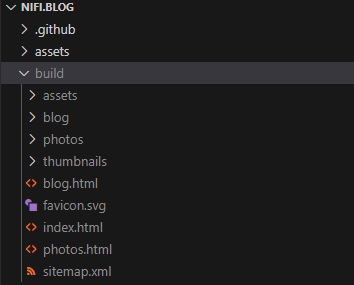
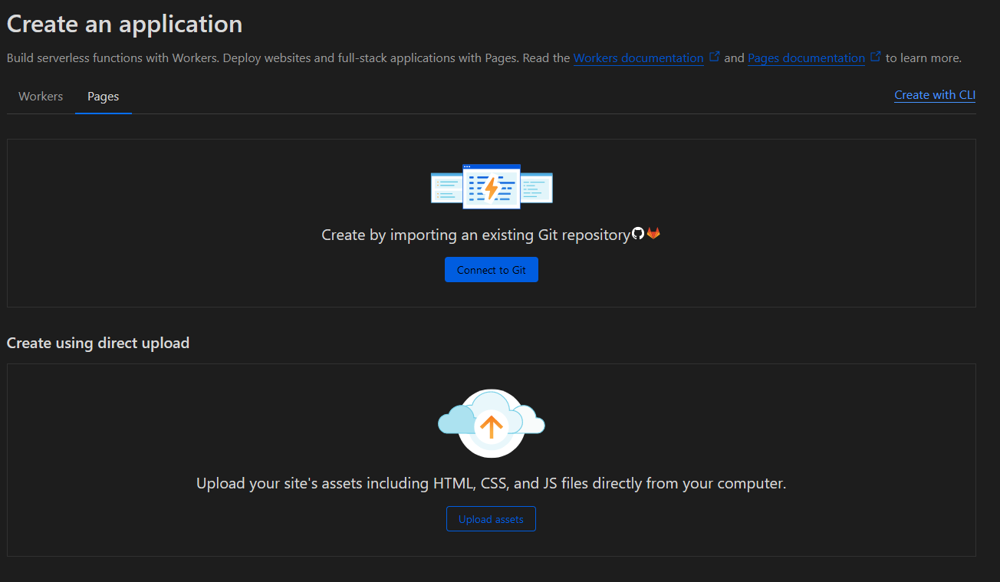
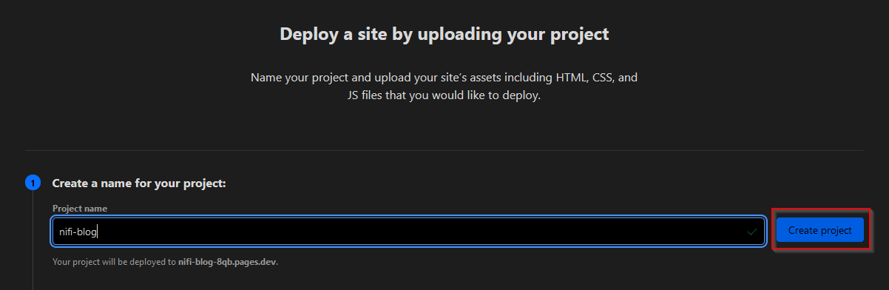

# The Making of this Website

Every person has a personal backlog. Items on it may include short-term things like doing the laundry or long-term commitments like learning Spanish, it doesn't matter as long as said activity can be conveniently postponed to some later date.

So my personal TODO list included creating a personal website for some time now, but I never got around to actually make one. Recentely, while helping a collegue to set-up a website for her charity (which I'll link once she's finished with the site), I decided that the time is now. I'm on semester break at my university so I've got some spare time to invest AND I get to share some photos. Sounds great, doesn't it?

## So I wanted a website...

This post was written in 2024. We have about a gadzillion ways and technologies for creating websites. I wanted something simple, like stupid-simple, from a technological perspective. So those fancy SPA/SSR frameworks and traditional CMS were out of the question. At first I looked at [Astro](https://astro.build/) and headless CMS like [Sanity](https://www.sanity.io/) and decided that those were too complicated. [Publii](https://getpublii.com/) is kind-of nice and lean, but still a tad too much. Then I finally arrived at static side generators. I've never seen the need for them previously, but now they seemed like a genious idea: I'll just write my own template for a SSG!

After some research I arrived at [Hugo](https://gohugo.io/), which was hailed to me by some folks on the great web as one of the leanest and cleanest solutions for my problem. And in earnest, I don't like it. Hugo has to cover a lot of use cases, so it has a lot of features I won't ever need. Furthermore, I would have to put a lot of template-code in my HTML, which I find rather ugly.

_Sigh..._ Fine. I'll do it myself.

## Meet Jeff

Hugo is written in [Go](https://go.dev/). I haven't written a single line of it before, so writing a SSG in it would be a great opportnity to learn it. Thus, [Jeff](https://github.com/a-nick-fischer/nifi.blog/blob/9b77766b5746d6394fe56bca7400a09dedcbc370/jeff.go) was born.

One way to see SSGs is as a DevOps build-pipeline (🐻 with me pls). In both cases you have unprocessed files (source code and templates) which one, well, processes. The end result is something useful which can be deployed.

So our "pipeline" looks the following:

```go
func main() {
	articles := readArticles()
	photos := readPhotos()
	templates := readTemplates()

    generatePagesFromTemplates(...)

    generateBlogEntriesFromMarkdown(...)

    generateThumbnails(...)
	
    copyAssetsToOutputDirectory(...)
}
```

> I'll leave out error handling in the code snippets 'cause I'm sure that you aren't interested in `if err != nil { log.Fatal(err) }`


## Templates

A good templating engine provides means to reuse templates and to hydrate templates. So ideally, something like this would be possible:

```html
<!-- common-things.html -->
<!-- Some meta info which is the same across pages -->
{{ define "meta" }}
<meta charset="UTF-8">
<meta name="viewport" content="width=device-width, initial-scale=1.0">
<meta name="author" content="Nick Fischer">
<link rel="icon" href="favicon.svg">
{{ end }}


<!-- article.html  -->
<!DOCTYPE html>
<html lang="en">
    <head>
        <!-- Here, we hydrate the template with data provided from Golang -->
        <title>{{.Title}}</title>

        <!-- Here, we reuse the above "meta" template -->
        {{ template "meta" }}
        ...
    </head>
    <body>
        ...
    </body>
</html>
```

To my delight, Go already provides a wonderful templating engine out-of-the-box called `text/template` (and another one called `html/template` for another usecase). To use it, first we'll load all templates in a directory into a single `template.Template` struct - in `readTemplates()` - which already allows us to define and reuse templates like we do above. 

Now, to hydrate templates, we first define structs for the data which should be passed to the template, e.g.:
```go
type Article struct {
	Title    string
	Summary  string
    Tags     []string
    HtmlBody string
	...
}
```

Then, we can use the following function to hydrate our templates:
```go
func generateTemplate(templates *template.Template, templateName string, args any) {
	htmlOutputPath := yos.JoinPath(OUTPUT_DIR, templateName)
	outputFile, _ := os.Create(htmlOutputPath)

	_ = templates.ExecuteTemplate(outputFile, templateName, args)
}

// later in code
generateTemplate(templates, BLOG_TEMPLATE_FILE, articles)
generateTemplate(templates, PHOTOS_TEMPLATE_FILE, photos)
...
```

## Markdown compilation
Next challange: converting markdown files to HTML. Ideally we'd also find a way to add some metadata to our files, like a summary and a title. Well, the [`goldmark`](https://github.com/yuin/goldmark) library has us covered. 

First, we'll write our article in Markdown and add some metadata using YAML:

```markdown
title: My Amazing Article!
summary: Please read me

---

# My Amazing article!
Whoop Whoop!
```

Using it, generating HTML from Markdown is as easy as:
```go
context := parser.NewContext()
var buf bytes.Buffer
markdown.Convert(source, &buf, parser.WithContext(context));
```

The `context` can then be used to extract the metadata:
```go
article := Article{
    Title:    metaData["title"].(string),
    Summary:  metaData["summary"].(string),
    HtmlBody: buf.String(),
    ...
}
```

## Thumbnail generation
Another task, another library. This time we'll use [`imaging`](https://github.com/disintegration/imaging) to resize our images to a suitable size using some math-magic-thingies:
```go
func generateThumbnail(imageName string) {
	imagePath := yos.JoinPath(PHOTOS_DIR, imageName)
	src, _ := imaging.Open(
		imagePath,
		imaging.AutoOrientation(true), // Respect orientation in EXIF Data
	)

	src = imaging.Resize(src, THUMBNAIL_WIDTH, 0, imaging.Lanczos)

	thumbnailPath := yos.JoinPath(THUMBNAILS_DIR, imageName)
	imaging.Save(src, thumbnailPath, imaging.JPEGQuality(80))
}
```

Thing is, this is slow. Like a-minute-for-50-images-slow. So we try to do a go-thing™ and parallelize it using goroutines. We have to use a wait-group to await all goroutines.


```go
var wg sync.WaitGroup
wg.Add(len(photos))

for _, image := range photos {
    go func(image string) {
        defer wg.Done()
        generateThumbnail(image)
    }(image.Name)
}

wg.Wait()
```

## Deploying
Now, Jeff is ready to generate our deployment. So we just run `go run .` and observe our `build` directory:


Whoop whoop, it works! :blush:

Great, now we have our static assets ready. And the best thing is ... 🥁 we can deploy it for free on [Cloudflare](https://pages.cloudflare.com/)! Well, we COULD also host it on [Netlify](https://www.netlify.com/) or [GitHub Pages](https://pages.github.com/), but Cloudflare is way faster (at least I was told so, which is enough for me to try it). So, how do we do it?

First, we need a domain name. I'm using `nifi.blog` as of now. Second, we need to create a new project on Cloudflare pages. We can do this by either connecting our GitHub or by `direct upload`:



Unfortunately, we cannot connect our GitHub in our case because we have a non-standard build pipeline - e.g. requiring the Golang toolchain. So we use the `direct upload` option, but we actually don't have to upload anything, we just have to name our project and create it:


Why is this thing hidden...

Now you can close this window and connect your custom domain. If you don't connect one, it will be automatically hosted on a `pages.dev` subdomain, e.g. `nifi-blog.pages.dev` or similar.

Alright, but how do we actually get our site on Cloudflare? Using a simple GitHub Action. But first, you need an API token and your account ID. Getting both is pretty easy: an API token can be created on [your profile page](https://dash.cloudflare.com/profile/api-tokens), you need a custom token with `Edit`-Permissions for `Cloudflare Pages` and your Account-ID can be seen in the Cloudflare Dashboard URL:


The blured thing is my acount ID

Now, we have everything we need to deploy using the following GitHub Action:


```yml
on: [push]

jobs:
  publish:
    runs-on: ubuntu-latest
    permissions:
      contents: read
      deployments: write
    name: Publish to Cloudflare Pages
    steps:
      - # <Checkout repo and setup Go>

      - name: Build
        run: |
          go mod download
          go run .

      - name: Publish to Cloudflare Pages
        uses: cloudflare/pages-action@v1
        with:
          # You have to create those two secrets in the repository settings on GitHub
          apiToken: ${{ secrets.CLOUDFLARE_API_TOKEN }}
          accountId: ${{ secrets.CLOUDFLARE_ACCOUNT_ID }}
          # Your project name on Cloudflare, the one we created earlier
          projectName: nifi-blog
          # The output directory of Jeff
          directory: build
```

# Viva La Jeff
Alright, by now you should have a ready website deployed on Cloudflare. Some things, like generating Sitemaps and extracting EXIF-Data from images can easily be added using libraries. 

Cheers :v: